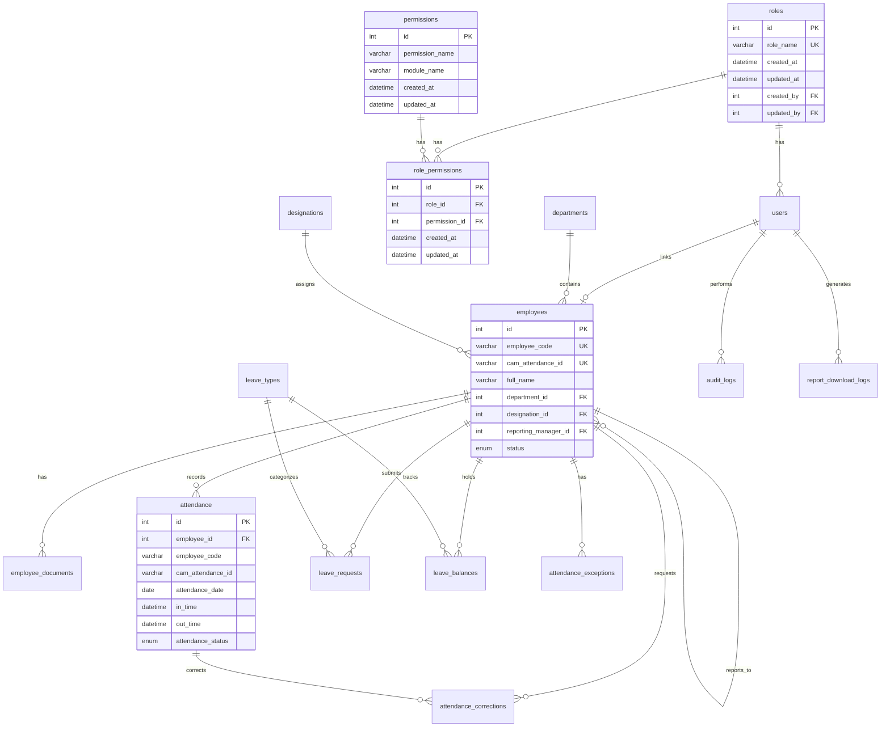

# VLJ HRMS — Database Architecture (Phase 2)

Enterprise-level MySQL database design for future Express.js + Prisma integration.

**No frontend changes. No backend yet. Database architecture only.**

---

## Design Principles

| Principle | Implementation |
|-----------|----------------|
| Normalized tables | 3NF with lookup tables for departments, designations, leave types, roles |
| Foreign keys | All relationships enforced via Prisma `@relation` with `onDelete` rules |
| Unique constraints | `employee_code`, `cam_attendance_id`, role names, composite keys |
| Audit ready | `audit_logs` table + `created_by`/`updated_by` on all mutable tables |
| Attendance mapping | **Never by name** — `employee_id`, `employee_code`, `cam_attendance_id` only |
| Dynamic permissions | `role_permissions` junction table — **never hardcode in backend** |
| Future modules | Schema extensible for payroll, assets, recruitment, performance (Phase 4+) |

---

## ER Diagram (Text Format)

```
┌─────────────┐       ┌──────────────────┐       ┌──────────────┐
│   roles     │───1:N─│ role_permissions │─N:1───│ permissions  │
│─────────────│       │──────────────────│       │──────────────│
│ id (PK)     │       │ id (PK)          │       │ id (PK)      │
│ role_name   │       │ role_id (FK)     │       │ permission_  │
│ created_at  │       │ permission_id(FK)│       │   name       │
│ updated_at  │       │ created_at       │       │ module_name  │
│ created_by  │       │ updated_at       │       │ created_at   │
│ updated_by  │       │ created_by       │       │ updated_at   │
└──────┬──────┘       │ updated_by       │       │ created_by   │
       │              └──────────────────┘       │ updated_by   │
       │ 1:N                                     └──────────────┘
       ▼
┌─────────────┐       ┌──────────────┐
│   users     │───1:1─│  employees   │
│─────────────│       │──────────────│
│ id (PK)     │       │ id (PK)      │
│ employee_id │       │ employee_code│◄── UNIQUE (CamAttendance mapping)
│ username    │       │ cam_attend.  │◄── UNIQUE (Kent/Cam ID)
│ email       │       │   _id        │
│ password_   │       │ first_name   │
│   hash      │       │ last_name    │
│ role_id(FK) │       │ full_name    │
│ is_active   │       │ department_  │───N:1──► departments
│ last_login  │       │   id (FK)    │
│ created_at  │       │ designation_ │───N:1──► designations
│ updated_at  │       │   id (FK)    │
│ created_by  │       │ reporting_   │───self──► employees (manager)
│ updated_by  │       │   manager_id │
└──────┬──────┘       │ status       │
       │              │ created_at   │
       │              │ updated_at   │
       │              │ created_by   │
       │              │ updated_by   │
       │              └──────┬───────┘
       │                     │
       │    ┌────────────────┼────────────────┬─────────────────┐
       │    │                │                │                 │
       │    ▼ 1:N            ▼ 1:N            ▼ 1:N             ▼ 1:N
       │ ┌────────────┐ ┌──────────┐ ┌──────────────┐ ┌─────────────────┐
       │ │ employee_  │ │attendance│ │leave_requests│ │leave_balances   │
       │ │ documents  │ │──────────│ │──────────────│ │─────────────────│
       │ └────────────┘ │ id (PK)  │ │ id (PK)      │ │ id (PK)         │
       │                │ employee │ │ employee_id  │ │ employee_id     │
       │                │   _id    │ │ leave_type_id│ │ leave_type_id   │
       │                │ employee │ │ from_date    │ │ total_leave     │
       │                │   _code  │ │ to_date      │ │ used_leave      │
       │                │ cam_att. │ │ manager_stat.│ │ remaining_leave │
       │                │   _id    │ │ hr_status    │ │ year            │
       │                │ attend.  │ │ final_status │ └─────────────────┘
       │                │   _date  │ └──────────────┘
       │                │ in_time  │         ▲
       │                │ out_time │         │ N:1
       │                │ working_ │    ┌──────┴──────┐
       │                │   hours  │    │ leave_types │
       │                │ overtime │    │─────────────│
       │                │ attend.  │    │ id (PK)     │
       │                │   status │    │ leave_name  │
       │                │ UNIQUE(  │    │ yearly_limit│
       │                │  emp_id, │    └─────────────┘
       │                │  date)   │
       │                └────┬─────┘
       │                     │ 1:N
       │                     ▼
       │              ┌──────────────────┐
       │              │attendance_       │
       │              │ corrections      │
       │              └──────────────────┘
       │
       ▼ 1:N
┌──────────────┐  ┌───────────────────┐  ┌──────────────┐  ┌──────────────────┐
│ audit_logs   │  │attendance_sync_   │  │attendance_   │  │report_download_  │
│──────────────│  │logs               │  │exceptions    │  │logs              │
│ id (PK)      │  │───────────────────│  │──────────────│  │──────────────────│
│ user_id (FK) │  │ id (PK)           │  │ id (PK)      │  │ id (PK)          │
│ module_name  │  │ sync_date         │  │ employee_id  │  │ report_type      │
│ action_type  │  │ total_records     │  │ attend. date │  │ generated_by(FK) │
│ old_value    │  │ success_records   │  │ issue_type   │  │ generated_at     │
│ new_value    │  │ failed_records    │  │ resolved     │  └──────────────────┘
│ action_date  │  │ status            │  └──────────────┘
└──────────────┘  └───────────────────┘

┌──────────────┐  ┌──────────────┐
│ departments  │  │  holidays    │
│──────────────│  │──────────────│
│ id (PK)      │  │ id (PK)      │
│ dept_name    │  │ holiday_name │
│ dept_code    │  │ holiday_date │◄── UNIQUE
└──────────────┘  │ holiday_type │
                  └──────────────┘
```

---

## Mermaid ER Diagram



---

## Table Summary (18 Tables)

| # | Table | Primary Key | Key Unique Constraints | Key Indexes |
|---|-------|-------------|------------------------|-------------|
| 1 | `roles` | `id` | `role_name` | `role_name` |
| 2 | `permissions` | `id` | `(permission_name, module_name)` | `module_name` |
| 3 | `role_permissions` | `id` | `(role_id, permission_id)` | `role_id`, `permission_id` |
| 4 | `users` | `id` | `username`, `email`, `employee_id` | `role_id`, `is_active` |
| 5 | `employees` | `id` | `employee_code`, `cam_attendance_id`, `email` | `dept_id`, `status`, `mobile` |
| 6 | `employee_documents` | `id` | — | `employee_id`, `document_type` |
| 7 | `departments` | `id` | `department_code` | `department_name` |
| 8 | `designations` | `id` | `designation_name` | — |
| 9 | `attendance` | `id` | `(employee_id, attendance_date)` | `employee_code`, `cam_attendance_id`, `attendance_date` |
| 10 | `attendance_sync_logs` | `id` | — | `sync_date`, `status` |
| 11 | `attendance_exceptions` | `id` | — | `employee_id`, `attendance_date`, `resolved` |
| 12 | `leave_types` | `id` | `leave_name` | — |
| 13 | `leave_balances` | `id` | `(employee_id, leave_type_id, year)` | `employee_id`, `year` |
| 14 | `leave_requests` | `id` | — | `employee_id`, `final_status`, `from_date` |
| 15 | `holidays` | `id` | `holiday_date` | `holiday_type` |
| 16 | `attendance_corrections` | `id` | — | `employee_id`, `status` |
| 17 | `report_download_logs` | `id` | — | `report_type`, `generated_at` |
| 18 | `audit_logs` | `id` | — | `user_id`, `module_name`, `action_date` |

---

## Attendance Design Rules

```
CamAttendance Device Punch
        │
        ▼
┌───────────────────────┐
│ attendance_sync_logs  │  ← tracks batch sync results
└───────────────────────┘
        │
        ▼
 Match by cam_attendance_id OR employee_code
 (NEVER by employee name)
        │
        ├── Match found ──► INSERT/UPDATE attendance
        │
        └── No match ─────► INSERT attendance_exceptions
                            (issue_type: Unmatched_Employee)
```

**`attendance` table stores:**
- `employee_id` — FK to employees (primary link)
- `employee_code` — denormalized for fast lookup / reports
- `cam_attendance_id` — CamAttendance / Kent device ID mapping
- **No `employee_name` column**

---

## Leave Workflow

```
Employee submits leave_request
        │
        ▼
manager_status: Pending → Approved / Rejected
        │
        ▼ (if manager approved)
hr_status: Pending → Approved / Rejected
        │
        ▼ (if HR approved)
final_status: Approved
        │
        ▼
Update leave_balances (used_leave, remaining_leave)
Update attendance records (status = Leave)
```

---

## Role → Permission Matrix (Seeded)

| Permission | employee | manager | hr | admin | super_admin |
|------------|:--------:|:-------:|:--:|:-----:|:-----------:|
| View Profile | ✓ | ✓ | ✓ | ✓ | ✓ |
| View Attendance | ✓ | ✓ | ✓ | | ✓ |
| Apply Leave | ✓ | ✓ | | | ✓ |
| View Leave Status | ✓ | ✓ | | | ✓ |
| Team Attendance | | ✓ | | | ✓ |
| Leave Approval | | ✓ | | | ✓ |
| View Team Reports | | ✓ | | | ✓ |
| Employee Management | | | ✓ | | ✓ |
| Attendance Correction | | | ✓ | | ✓ |
| Final Leave Approval | | | ✓ | | ✓ |
| Generate Reports | | | ✓ | ✓ | ✓ |
| User Management | | | | ✓ | ✓ |
| Department Management | | | | ✓ | ✓ |
| Role Management | | | | ✓ | ✓ |
| Attendance Monitoring | | | ✓ | ✓ | ✓ |
| System Settings | | | | ✓ | ✓ |
| Full Access | | | | | ✓ |
| View Audit Logs | | | | | ✓ |
| Configure System | | | | | ✓ |
| Approve Any Leave | | | | | ✓ |

> Backend (Phase 3) must query `role_permissions` JOIN `permissions` — never hardcode.

---

## Setup Instructions (When MySQL Credentials Are Ready)

```bash
# 1. Copy environment file
cp .env.example .env
# Edit DATABASE_URL with your MySQL credentials

# 2. Create database
mysql -u root -p -e "CREATE DATABASE vlj_hrms CHARACTER SET utf8mb4 COLLATE utf8mb4_unicode_ci;"

# 3. Run Prisma migration
npx prisma migrate dev --name init

# 4. Seed roles and permissions
npx prisma db seed

# 5. Generate Prisma Client (for Phase 3 backend)
npx prisma generate
```

---

## Future Module Extension Points (Phase 4+)

| Module | Extension Strategy |
|--------|-------------------|
| Payroll | Add `payroll_runs`, `salary_structures`, `payslips` linked to `employee_id` |
| Asset Management | Add `assets`, `asset_assignments` linked to `employee_id` |
| Recruitment | Add `job_postings`, `candidates`, `interviews` — hire flow creates `employees` record |
| Performance | Add `review_cycles`, `performance_reviews` linked to `employee_id` |
| CamAttendance | `attendance_sync_logs` + `attendance_exceptions` already prepared |

---

## Files in This Phase

| File | Purpose |
|------|---------|
| `prisma/schema.prisma` | Complete Prisma schema (18 tables) |
| `prisma/seed.js` | Roles, permissions, role_permissions seed |
| `.env.example` | Database URL template |
| `docs/DATABASE_DESIGN.md` | This documentation |
